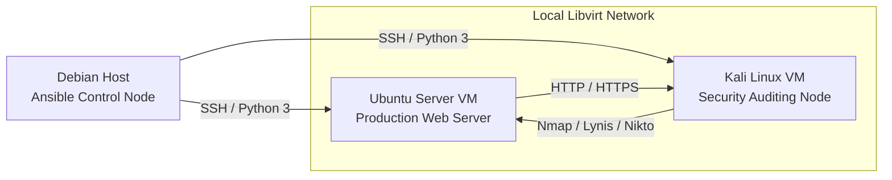

<h1 align="center">Automated Linux Hardening Range</h1>

## Project Overview

This repository implements a fully local Infrastructure-as-Code security range using Ansible on a Debian host machine. The control node manages two KVM/Virt-Manager guests on the libvirt NAT network `192.168.122.0/24`:

- Ubuntu Server VM: hardened as a production-style web server.
- Kali Linux VM: provisioned as a continuous auditing and validation node.

The design follows standard Ansible role separation, inventory-driven host targeting, and repeatable configuration management. The Ubuntu host is locked down through UFW, Fail2ban, SSH hardening, logging, and unattended updates. The Kali host receives a security toolchain and an automated post-install audit workflow that continuously records results to local logs.

## Architecture Diagram



Textual interpretation of the architecture:

- The Debian host is the only administrative control plane.
- Both guests live on the local libvirt bridge/NAT segment `192.168.122.0/24`.
- Ansible connects to each VM over SSH using key-based authentication.
- Ubuntu exposes only the services required for a web server, while Kali observes and audits the Ubuntu service surface from the same private lab network.

## Prerequisites for Virt-Manager Network Setup

1. Install the virtualization stack on the Debian host.

   ```bash
   sudo apt update
   sudo apt install -y qemu-kvm libvirt-daemon-system libvirt-clients virt-manager bridge-utils
   ```

2. Confirm the libvirt NAT network is active.

   ```bash
   virsh net-list --all
   virsh net-start default
   virsh net-autostart default
   ```

3. Attach both VMs to the default libvirt network so they receive `192.168.122.x` addresses.

4. Assign stable addresses in the inventory file. This project uses:

   - Ubuntu Server VM: `192.168.122.194`
   - Kali Linux VM: `192.168.122.133`

5. Ensure SSH key access exists before running Ansible.

   - Ubuntu should allow the non-root administrative user defined in `hosts`.
   - Kali should allow the non-root administrative user defined in `hosts`.

6. Verify each VM can reach the other over the local lab subnet.

   ```bash
   ping -c 2 192.168.122.194
   ping -c 2 192.168.122.133
   ```

## Deployment Steps

1. Review and adjust `hosts` if your libvirt DHCP leases differ from the default values.

2. Ensure your SSH public key is installed on both guests for the users listed in the inventory.

3. From the repository root, run the master playbook.

   ```bash
   ansible-playbook site.yml
   ```

4. Run only one automation group by tag when you want a narrower change window.

   ```bash
   ansible-playbook site.yml --tags hardening
   ansible-playbook site.yml --tags webserver
   ansible-playbook site.yml --tags logging
   ansible-playbook site.yml --tags automation
   ansible-playbook site.yml --tags tooling --limit kali_nodes
   ansible-playbook site.yml --tags audit --limit kali_nodes
   ```

5. Validate the Ubuntu hardening outcome.

   ```bash
   sudo ufw status verbose
   sudo systemctl status fail2ban
   sudo sshd -T | grep -E 'permitrootlogin|passwordauthentication|pubkeyauthentication'
   ```

6. Start or stop the web server with the dedicated lifecycle playbook.

   ```bash
   ansible-playbook playbooks/webserver.yml -e nginx_state=started
   ansible-playbook playbooks/webserver.yml -e nginx_state=stopped
   ansible-playbook playbooks/webserver.yml -e nginx_state=restarted
   ```

7. Power off both lab VMs together with the dedicated shutdown playbook.

   ```bash
   ansible-playbook playbooks/poweroff.yml
   ```

8. Validate the Kali audit automation.

   ```bash
   ls -l /var/log/kali-audit
   sudo run-parts --test /etc/cron.daily
   ```

   The directory is intentionally empty until the audit runner executes for the first time. The Ansible logging task only creates the directory, while the audit task writes timestamped reports when the runner is invoked.

   To generate the first report immediately, run:

   ```bash
   sudo /usr/local/bin/kali-post-install-audit.sh
   ```

9. Review the generated audit logs on the Kali node after the first cron execution.

   ```bash
   sudo ls -1 /var/log/kali-audit
   sudo tail -n 50 /var/log/kali-audit/post-install-*.log
   ```

## Operational Notes

- Host key checking is disabled in `ansible.cfg` to simplify lab execution against disposable VMs.
- The playbook enforces the `192.168.122.0/24` subnet to keep the range constrained to the local virtualization fabric.
- Ubuntu SSH hardening disables root login and password authentication, so key-based access must already exist.
- The Kali audit workflow is scheduled through `cron.daily`, which keeps the range self-documenting and repeatable for demonstrations or viva evaluation.
- Tagged runs let you apply only a single concern, such as `hardening`, `webserver`, `logging`, or `automation`, without touching the rest of the range.
- The `/var/log/kali-audit` directory is created during provisioning, but audit reports appear only after the Kali audit runner is executed manually or by `cron.daily`.

## Automation Matrix

| Concern | Scope | Command |
| --- | --- | --- |
| Full platform run | Ubuntu + Kali | `ansible-playbook site.yml` |
| Hardening only | Ubuntu security controls | `ansible-playbook site.yml --tags hardening` |
| Web server lifecycle | Nginx start/stop/restart | `ansible-playbook playbooks/webserver.yml -e nginx_state=started` |
| Logging and retention | Log directory and logrotate | `ansible-playbook site.yml --tags logging` |
| Scheduled audit automation | Kali audit jobs | `ansible-playbook site.yml --tags automation` |
